OpenCV

Resimleri üst üste getirmek

 +

 = 

Teşekkür;

Bana bunu öğrettiği için değerli Mustafa Ünlü’ye teşekkür ederim.

Youtube video linki;

[Tıkla Git](https://www.youtube.com/watch?v=gMpBJ7YBxTY)

Bilmemiz gerekenler;

1) Resimlerde temelde renk kodu olarak; Red, Green ve Blue bulunur
1) Cv2 resimleri Green, Blue, Red olarak okur
1) Matplotlib.pyplot ise Red, Green, Blue olacak şekilde okur
1) Resimler matrislerden oluşur her piksel 3 indisli bir matristir yani her pikselde R G B kanalları bulunur bu kanallardan baskın olma durumunu 0’dan 255’e kadar olan sayılarla belirleriz

Yani; bir pikselin sadece kırmızı olmasını istersek renk kodu olarak; 255 000 000 vermemiz gerekir, sadece mavi olmasını istiyorsak, 000 000 255 vermemiz gerekir.

1) Bilgisayarda bitler arasında çarpma ve toplama işlemi aşağıdaki gibidir

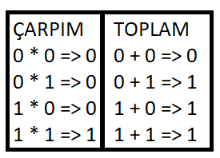

# Kütüphaneleri dahil edelim

Öncelikle kullanacağımız kütüphaneleri projeye dahil edelim

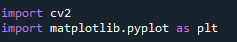
# Görselleri dahil edelim
Kullanacağımız görselleri projeye dahil edelim

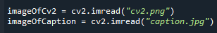

Göstermek gerekirse

# Tanımları oturtalım
Üzerine koyacağımız resim: imageOfCaption

Üzerine koyulacak resim: imageOfCv2

# Kesme/Kırpma İşlemi
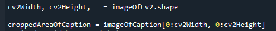

Kız kulesi resmini(caption.jpg | imageOfCaption ), 

OpenCV logosu(cv2.png | imageOfCv2) alanı kadar kırpalım

imageOfCv2.shape diyerek imageOfCv2’nin yükseklik ve genişlik değerlerini aldık.

croppedAreaOfCaption içerisine ise, 

imageOfCaption resminin X düzleminden 0. Koordinattan, imageOfCv2’nin genişliği kadar ve imageOfCaption resminin Y düzleminden 0. Koordinattan, imageOfCv2’nin yüksekliği kadar kesilmiş hali bulunuyor.

Yani; kırmızı ile gösterilmiş alan kadar kesilecek

Göstermek gerekirse:

# Griye Çevirmek
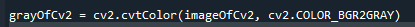

Cv2(imageOfCv2) logomuzu gri tonlamaya çevireceğiz, bunu yapma sebebimiz, threshold uygulayarak arkaplandaki siyah alandan komple kurtulmak

# Maskeleme işlemi Threshold
En önemli adımlardan bir tanesi olan bu adımda; cv2 içerisindeki threshold metodunu, belirli bir renk tonunun üstündeki tonları başka bir renk tonuna çevirmek için kullanacağız.

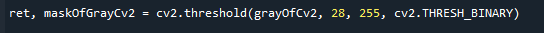

grayOfCv2 resmindeki 28 tonunun üstündeki bütün renk tonlarını 255’e çevir dedik.

Bunu neden yaptık?

` `Yan tarafta gözükeceği gibi 

Cv2 logosu içerisindeki en çok siyaha yakın olan rengimiz ok ile işaret ettiğim şekilde bulunuyor bu renk tonunu da sağ üst tarafta görebiliriz.

Bu durumda 28 renk tonunun üstündeki bütün renkleri beyaza çevirirsek aşağıdaki görseli elde edebilriz

# Rengi tersine çevirmek
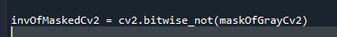

Göstermek gerekirse;

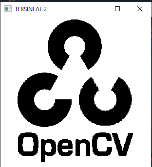Bu işlemi neden yaptık?

Beyaz, renk kodu olarak 255 tekabul eder.

Siyah ise 0’a. Beyaz’ın 1, Siyahın ise 0 olduğunu düşünecek olursak, ilk başta bilinmesi gerekenler klavuzunda 1 ile 0’u çarptığımızda 0 sonucunu elde edeceğiz. Yani yan taraftaki görüntü ile başka bir görüntüyü bit çarpımı yaparsak, arkaplandaki görüntü beyaz yani 1 olacağından; diğer görüntüdeki aynı alandaki piksellerin renklerini alacaktır.

Bunu şu şekilde de anlatmak mümkün;

Beyaz olan kısmın heryerinde 1 olduğunu ( 1 = 255,255,255 varsayarsak) düşünelim.

Bu 1 ile 0’ı çarptığımızda 0 sonucunu elde ederiz.

255 ile başka bir renk tonunu çarparsak

Diğer renk tonuna eşit olur

255 \* 120 = 30600;

30600 MOD 255 = 120;

Bu durumda da 1 olan kısımlar (yani arkaplanı beyaz olan kısımlar) çarpıldığı piksellerin rengini alacaktır.

# Pikselleri çarpma

**Kırpma işlemi** adımında caption üzerinden bi kısım kırpma işlemi yapmıştık şimdi kırptığımız resimdeki pikseller ile elimizde tersini aldığımız görseli çarpacağız

\*

ÇARP

Açıklama: 1. Resim ile 2. Resmi bit çarpımı yaptık, 2.resimde beyaz olan yerlerin 1(255) olarak ifade etmiştik, 1. Resimde de, 2. Resimdeki beyaz piksellerin denk geldiği piksellerin farklı renk tonlarında olması ile birlikte çarpma işleminde 1 ile neyi çarparsak çarpıldığı değer’e eşit olacağından arkplanın piksellerinin reklerini(RGB) almış oldu.

# Pikselleri toplama işlemi
Yine önemli adımlardan bir tanesi olan bu adımımızda **Pikselleri Çarpma Başlığında** oluşturuduğumuz pikseller ile, orjinal open cv logosunun piksellerini TOPLAMA işlemi yapacağız.

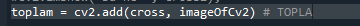

 							+

`						`TOPLA

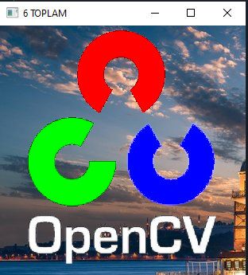Toplama işlemi sonucunda yan taraftaki görüntüyü elde ederiz.

Açıklama;

6.adımdaki yaptığımız işlemde open cv logosunun siyah olan kısımlarının(piksellerini) 0 olarak ifade edelim (0,0,0). Orjinal open cv logosunda ise siyah olan kısımlar yine 0, renkli olan kısımlar ise 1 olduğunu düşünelim. En başta bit işlem toplama tablosunda toplama işleminde 0 ile 1 toplam sonucu 1’e eşit olacağından, siyah olan kısımlar renklendirilmiş oldu.

Bunu şu şekilde de anlatalım;

Orjinal open cv resmini şu şekilde düşünebiliriz;

Siyah kısımlar 0, renkli kısımlar ise 1 olacak şekilde.

Tabiki renkli kısımların kendine ait renk kodları var ama biz kolay anlaşılsın diye 1 olarak ifade ediyoruz. Siyah kısımlar ise gerçekten de renk kodu olarak 0, 0, 0’a rekabul etmektedir.

**Pikselleri çarpma başlığında** elde ettiğimiz görüntünün yine yukarıda anlattığımız gibi düşünecek olursak, yani siyah kısımlarının 0, renkli kısımlarının ise 1 olduğunu varsayar isek. Şu şekilde düşünebiliriz.

**Renkli bir bit ile renksiz bir bitin toplamı Renkli bite eşit olur(bitler arasında toplama işlemi)** bu durumda da yandaki görüntüyü elde ederiz.

# Yerleştirme
**Pikselleri toplama** başlığında ettiğimiz görüntüyü(pikselleri), **kırpma adımında** kestiğimiz kısma yerleştireceğiz

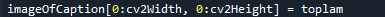

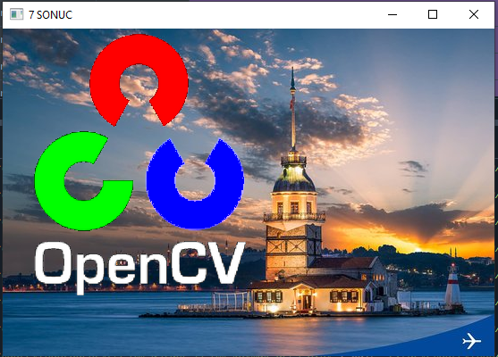
